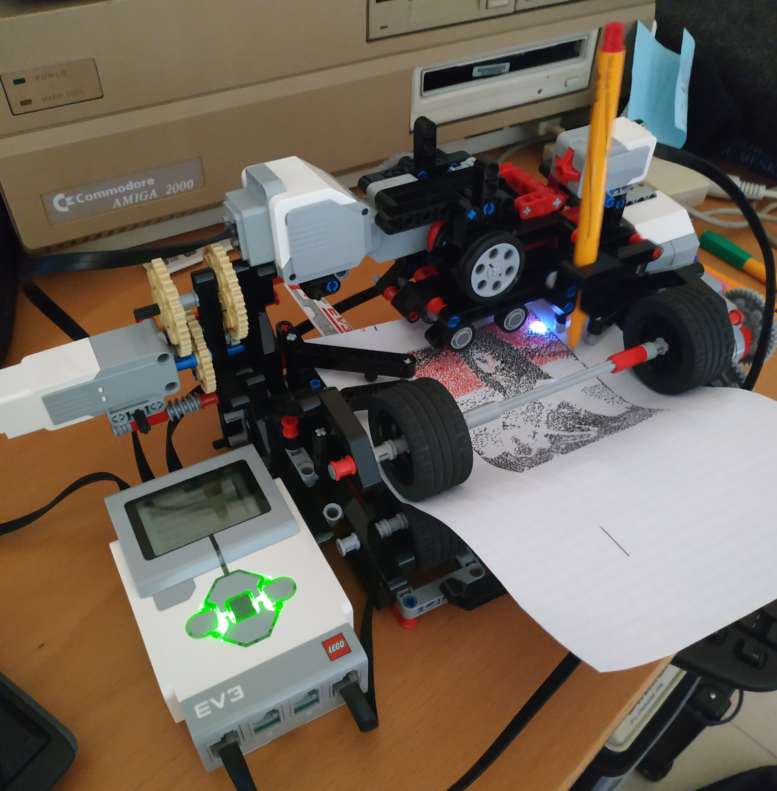

## Table of contents
* [General info](#general-info)
* [Technologies](#technologies)
* [Setup](#setup)
* [How to run](#how-to-run)
* [Features](#features)
* [Status](#status)

## General info
This project is a printer made of [Lego Mindstorms EV3 set](https://brickset.com/sets/31313-1/Mindstorms-EV3)

### Printer

In order to run this project you obviously need to build your own lego printer.
It does not need to be identical to mine, but they must share some features, described below:
TODO

Assembling instructions:
TODO

### Software
The main.py script loads an input file, changes its resolution, reduces it to
dithered 2 color image and finally prints it.

## Technologies
* python
* ev3dev library

## Setup
Use this [instruction](https://www.ev3dev.org/docs/getting-started/) to set everything up:

## How to run
TODO

## Features
* Paper format: A5
* Output resolution: 160 x 180
* Number of colors: 2 (pen color + background). Uses dithering.
* Semi-automatic calibration

Sample printouts:

### Future features:
* Resolution increased to 320 x 360
* Multi color printing (automatic pen switcher or multi-pass printing with manual color switching before each pass)
* Improved speed and accuracy
* Automatic calibration

## Status
The project is in progress. It started as a proof of concept. Lots of stuff is still hard-coded.
Refactoring ongoing.
