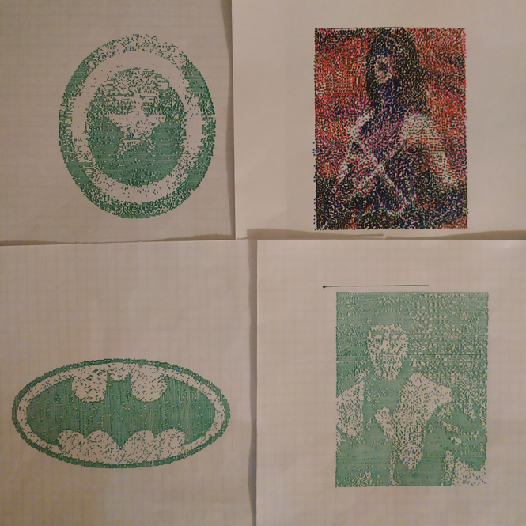

## Table of contents
* [General info](#general-info)
* [Technologies](#technologies)
* [Setup](#setup)
* [How to run](#how-to-run)
* [Features](#features)
* [Status](#status)

## General info
This project is a printer made of [Lego Mindstorms EV3 set](https://brickset.com/sets/31313-1/Mindstorms-EV3)

### Printer

In order to run this project you obviously need to build your own lego printer.
It does not need to be identical to mine, but they must share some features, described below:
TODO

Assembling instructions:
TODO

### Software
Python scripts load an input file, change its resolution, reduce the number of colors
to 2 (single pen) or 6 (5 pens) and finally print it.

## Technologies
* python
* ev3dev library

## Setup
Use this [instruction](https://www.ev3dev.org/docs/getting-started/) to set everything up:

## How to run
TODO

## Features
* Paper format: A5
* Output resolution: 150 x 180
* Number of colors in basic mode: 2 (pen color + background).
* Number of colors in multicolor mode: 6 (5 pens + background). Multi-pass printing with manual pen switching.
* Semi-automatic calibration

Sample printouts:

### Future features:
* Resolution increased to 300 x 360
* Multicolor printing with any number of pens.
* Improved accuracy

## Status
The project is in progress.
